# Diplomacy TUI — Simplified Architecture & UML Reference

This is a planning document, not code. It exists to answer one question before you touch `cargo new`: **what's the smallest set of components that still gives you every feature you asked for, expressed with real GoF patterns and real Rust idioms, without regrowing into the 25-file sprawl from last time?**

Everything below assumes the feature list from your prompt:
- Host sets up a game → `game_id` → shares it
- Accounts, registration, login
- Players join a game → feed updates for everyone connected
- Moves can be submitted when the host is offline (queued)
- Messaging
- Order entry via a finite-state-machine UI (you called it "Turing machine-like" — see the terminology note below)
- Game browser shows only *discoverable* games
- Back navigation from any screen
- GoF-style OOP, Rust idioms

---

## 0. Terminology note

A "Turing machine-like UI" — a machine with a fixed set of states, one active state at a time, and transitions triggered by input — is a **finite state machine (FSM)**, which is exactly what the GoF **State pattern** formalizes as OOP. You already had this instinct in the old `state_machine.rs`. This doc keeps it, but promotes it from "the thing order entry does" to "the thing the *entire TUI* does" — screens are states too, which is what gives you back-navigation for free (see §7).

---

## 1. Stack

| Concern | Choice | Why |
|---|---|---|
| Language | Rust, Cargo **workspace** with 3 crates | Compiler-enforced module boundaries instead of convention |
| TUI | `ratatui` + `crossterm` | Unchanged from before, it works |
| Async runtime | `tokio` | Needed for the host's concurrent connections regardless |
| Host↔Client protocol | Raw TCP, newline-delimited **JSON** via `serde_json` | Replaces the hand-rolled `LOGIN;user;pw` parser — `#[derive(Serialize, Deserialize)]` on one `enum Protocol` eliminates a whole category of parsing bugs and is the "leverage Rust" move for the wire format |
| Backend | Supabase: **Auth** + **PostgREST** (`/rest/v1/...` over `reqwest`) + **Realtime Broadcast** | No SeaORM, no direct Postgres connection anywhere — see §2 |
| Errors | `thiserror` inside each crate, `anyhow` only at the two `main.rs` binaries | Library code returns typed errors; binaries collapse them |

**Cut for now:** the Node.js SVG→braille map renderer. It's a separate process with its own retry/lifecycle logic and it doesn't touch any of the 8 features you listed. Render the board as a `ratatui` table (territory → owner → unit) instead. Bring the fancy map back later as an optional widget once the core loop is solid — it was never coupled to game logic anyway, so nothing here forecloses it.

---

## 2. What got simplified, and why

| Old | New | Reasoning |
|---|---|---|
| SeaORM + direct Postgres pool (`connection_pool.rs`, `user.rs`, `game.rs` as entities) | Supabase REST (`PersistenceGateway` trait, one `reqwest`-based implementation) | Supabase already **is** a generated CRUD API (PostgREST). An ORM on top of an ORM-shaped API is a redundant layer. This deletes an entire subsystem. |
| Two data-access paths (host uses SeaORM, client falls back to a separate "Supabase client" for the offline queue) | **One** `PersistenceGateway` trait, used identically by host and client | Host and client were always doing the same kind of thing — read a row, write a row — they just used different tools to do it. Unify the tool. |
| Chat implied to route through the host (implicitly, since it wasn't designed) | Messaging never touches the host. Client writes a row to `messages`, other clients get it via **Supabase Realtime Broadcast** or a light poll. | A chat message has no game-rules meaning — it doesn't need adjudication, so it doesn't need the host. Decoupling it means chat still works while the host process is down, for free. |
| `state_machine.rs`, `order_builder.rs`, `util.rs`, `fake_context.rs` scattered at top level | One `screens/order_entry.rs` module containing the FSM + builder | These four files were all "how does a player build one order" — that's one responsibility, one module. |
| `order_repository.rs` (a stub wrapping `ConnectionPool`) | Deleted — folded into `SnapshotService` / `QueuePoller` | It did nothing a direct call couldn't. |
| Global `GAME_REGISTRY` (implied `static`/`lazy_static`) | `Arc<RwLock<HashMap<GameId, GameHandle>>>` created once in `main`, cloned into every connection task | Classic GoF Singleton assumes global mutable state is fine. Rust's ownership model makes that an anti-pattern (needs `unsafe` or a `OnceCell` workaround for no real benefit) — dependency injection via `Arc::clone` gives you the "one shared registry" property *and* keeps the borrow checker's guarantees. This is the one place where "GoF style" and "idiomatic Rust" actively disagree, and Rust wins. |

Net effect: **3 crates, ~20 files total**, each with one clear job, versus 25+ files where responsibility was smeared across `util.rs`-style grab bags.

---

## 3. Workspace layout

```
diplomacy/
├── Cargo.toml                    # [workspace] members = ["crates/*"]
├── crates/
│   ├── core/                     # diplomacy-core (lib, zero I/O)
│   │   ├── board.rs              #   Board, Territory, Unit
│   │   ├── order.rs              #   Order enum
│   │   ├── phase.rs              #   GamePhase enum + PhaseHandler trait [State]
│   │   ├── validator.rs          #   OrderValidator strategies       [Strategy]
│   │   └── protocol.rs           #   wire message enum, serde derive
│   │
│   ├── host/                     # diplomacy-host (bin)
│   │   ├── main.rs               #   tokio TCP listener, spawns per-connection tasks
│   │   ├── registry.rs           #   GameRegistry                    [Registry, not Singleton]
│   │   ├── game_handle.rs        #   GameHandle (one live game)
│   │   ├── order_collector.rs    #   OrderCollector strategies       [Strategy]
│   │   ├── snapshot_service.rs   #   pull/push GameContext JSON
│   │   ├── queue_poller.rs       #   pull pending orders while offline-catch-up
│   │   └── gateway.rs            #   PersistenceGateway impl (reqwest → Supabase)
│   │
│   └── client/                   # diplomacy-client (bin, the TUI)
│       ├── main.rs               #   sets up channels, spawns network thread, runs App
│       ├── app.rs                #   App: screen stack + shared game state
│       ├── screens/
│       │   ├── mod.rs            #   Screen trait + Transition enum    [State]
│       │   ├── main_menu.rs
│       │   ├── auth.rs           #   login / register forms
│       │   ├── browser.rs        #   discoverable games list
│       │   ├── lobby.rs          #   feed, players, chat entry point
│       │   ├── order_entry.rs    #   the order FSM lives here
│       │   └── messaging.rs
│       ├── commands/
│       │   ├── mod.rs            #   Command trait + CommandFactory   [Command, Factory]
│       │   ├── login.rs / register.rs / create.rs / join.rs / order.rs / message.rs
│       ├── network.rs            #   network thread, TCP Client trait impl
│       ├── events.rs             #   AppEvent, GameEvent, AppCommand
│       ├── session.rs            #   SessionKeeper — unchanged from before
│       └── gateway.rs            #   PersistenceGateway impl, same trait as host's
```

`core` has no `tokio`, no `reqwest`, no I/O of any kind — it's pure data + rules, which means it's trivially unit-testable and both `host` and `client` depend on it for shared types (`Order`, `GamePhase`, `Protocol`).

---

## 4. GoF pattern map

| Pattern | Where | Rust-specific note |
|---|---|---|
| **State** | `Screen` trait (TUI navigation) and `PhaseHandler` trait (game turn phases) | Rust enums with data make illegal states unrepresentable — `GamePhase` can't be "SpringMovement with retreat data attached." The compiler's exhaustive `match` also guarantees you never forget to handle a new phase/screen. |
| **Command** | `Command` trait + `CommandFactory` | Same structure you already had — kept as-is, it's a good fit. |
| **Strategy** | `OrderValidator` (movement/retreat/build rules differ), `OrderCollector` (same three variants, host side) | Trait objects (`Box<dyn OrderValidator>`) selected by `GamePhase` at runtime. |
| **Builder** | Order construction inside `order_entry.rs` (unit → order type → target → support target) | Each FSM step fills one field; `build()` only callable once all required fields are set — enforce with a typestate-lite pattern if you want extra safety. |
| **Observer** | `GameEvent` broadcast from host → all connected clients' feeds | Implemented as a `tokio::sync::broadcast` channel on the host and an `mpsc` channel on the client, **not** a list of observer trait objects. Channels are the idiomatic Rust Observer: the "subject" doesn't hold references to its "observers," it just clones a `Sender`. No lifetime headaches. |
| **Factory Method** | `CommandFactory::parse`, `PhaseHandler::for_phase(GamePhase)` | Centralizes "given this tag, give me the right object." |
| **Registry** (GoF calls this a variant of Singleton; see §2) | `GameRegistry` | Deliberately **not** a global static — `Arc<RwLock<HashMap<...>>>` injected via `Arc::clone`, satisfying "one shared instance" without a Rust anti-pattern. |
| **Adapter** | `PersistenceGateway` trait, single `SupabaseGateway` impl | Isolates "we talk to Supabase over REST" behind an interface, so if you ever swap backends, only `gateway.rs` changes. |
| **Template Method** | `Command::execute()` skeleton: build message → send → parse response, unchanged from your original code | Kept because it already worked. |

---

## 5. System component diagram

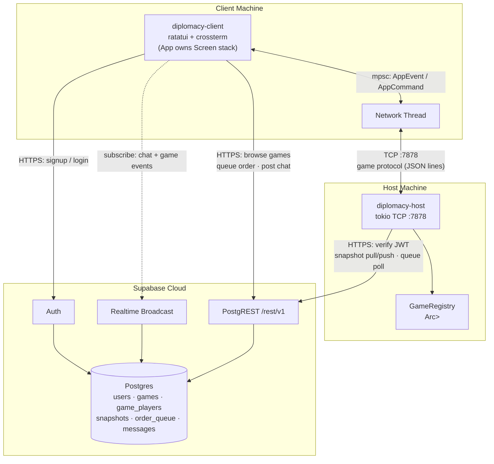

---

## 6. Core domain — class diagram

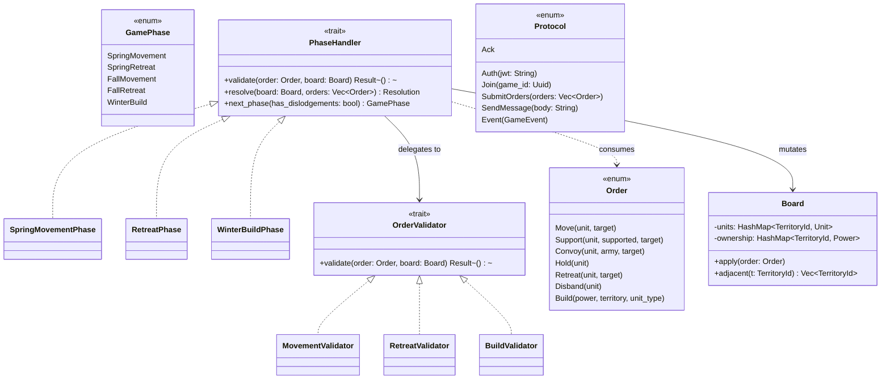

---

## 7. Client — Screen subsystem (State pattern + back-stack)

This is the piece that directly answers "back navigation" and "Turing machine-like UI": `App` holds a `Vec<Box<dyn Screen>>` as a stack. Entering a new screen pushes; pressing Back pops. No separate "back logic" needed anywhere — it's a property of the stack.

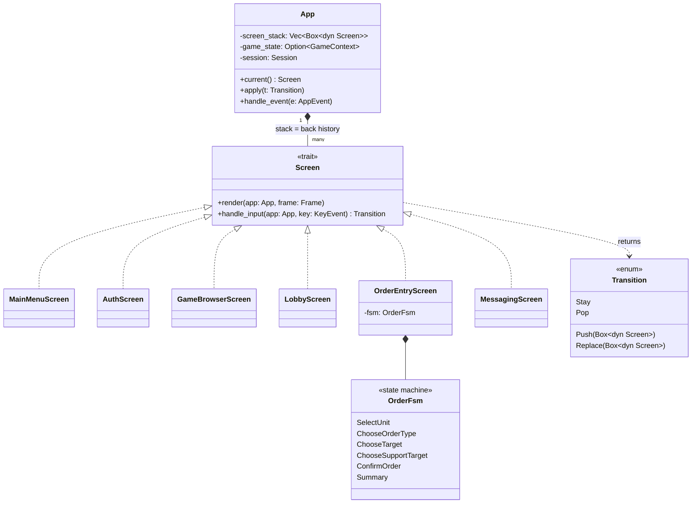

---

## 8. Client — Command, Networking & Persistence

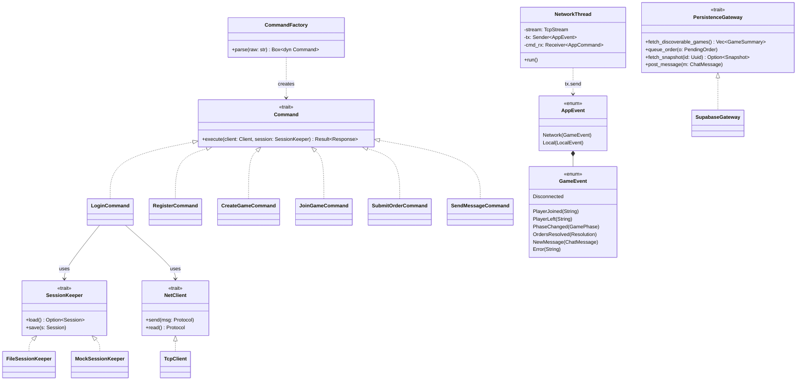

---

## 9. Host — Registry & Game subsystem

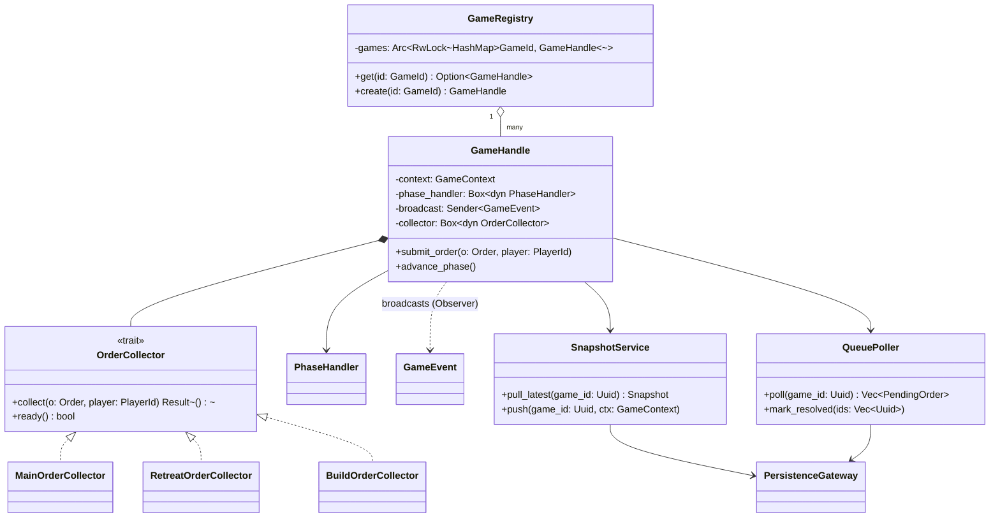

---

## 10. State diagrams

### 10a. TUI navigation (back-stack in action)

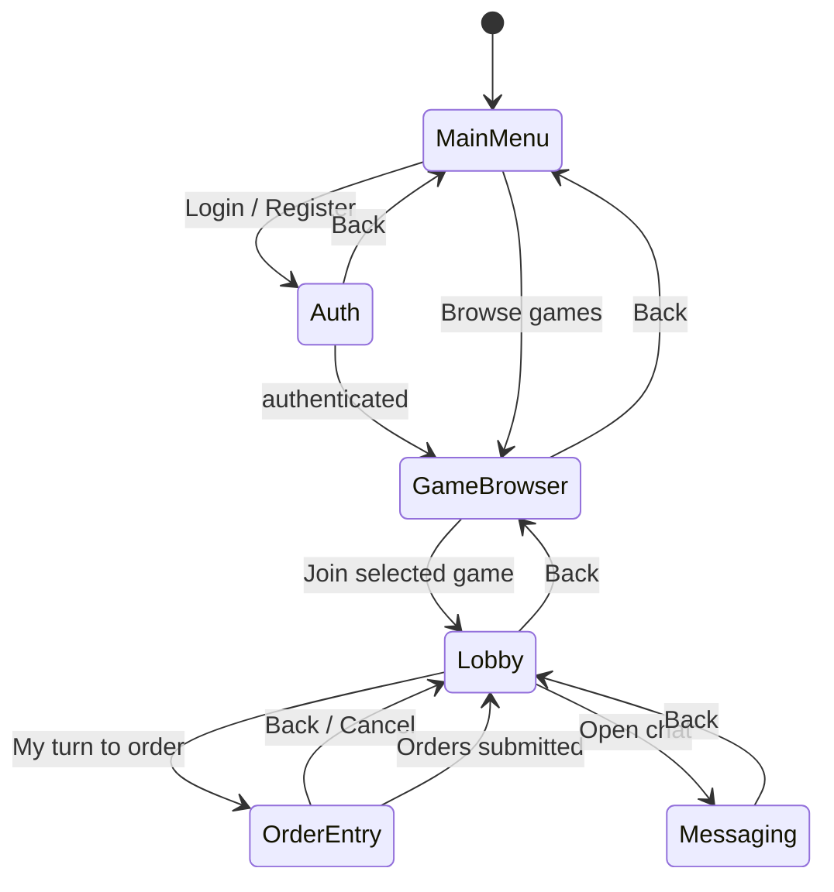

### 10b. Order-entry FSM (the "Turing machine" screen)

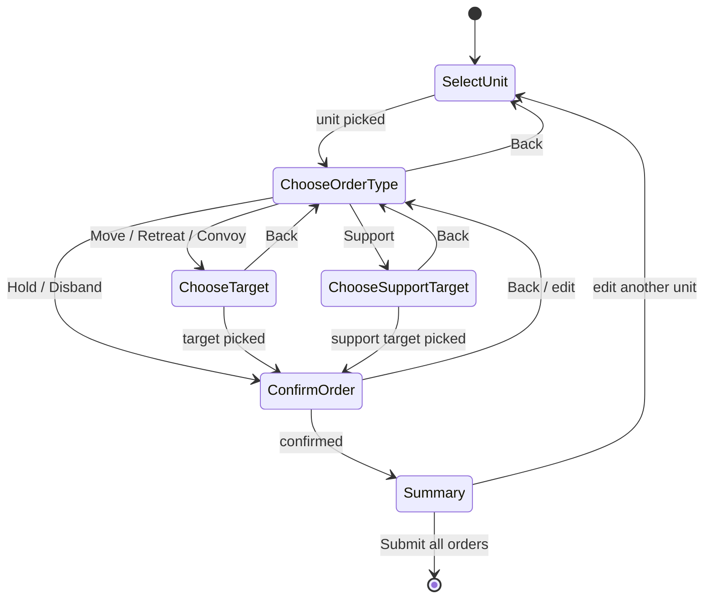

### 10c. Game phase FSM (host-side, per Diplomacy rules)

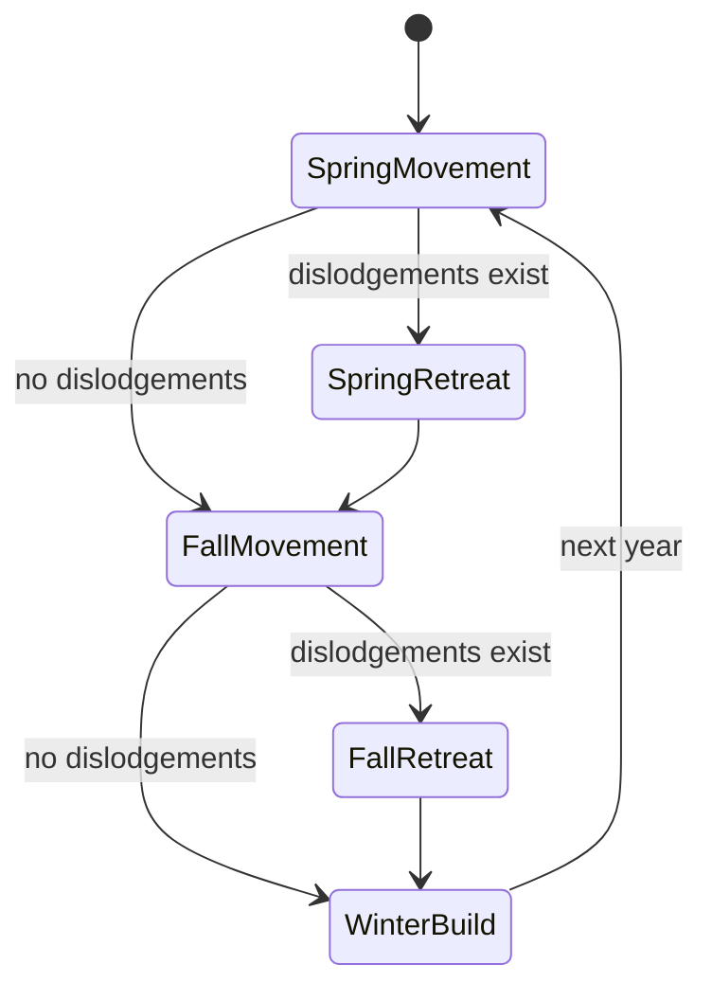

---

## 11. Sequence diagrams

### 11a. Register → Login

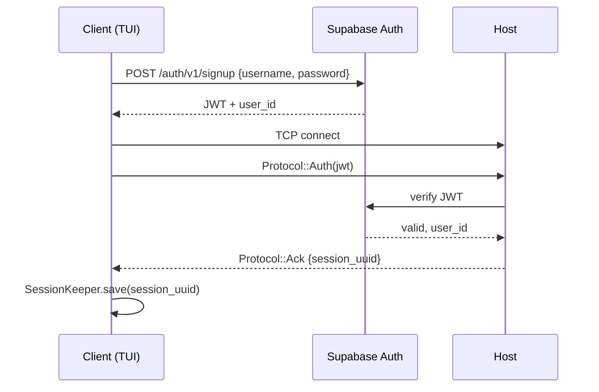

### 11b. Create game → discover → join → feed updates

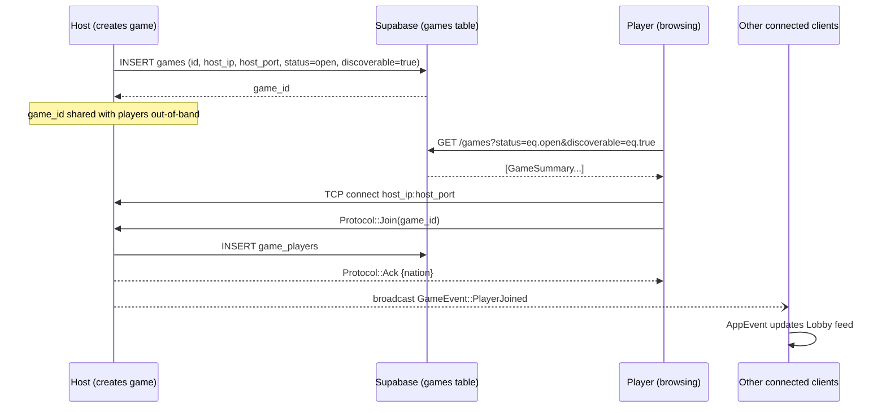

### 11c. Submitting an order — host online vs offline

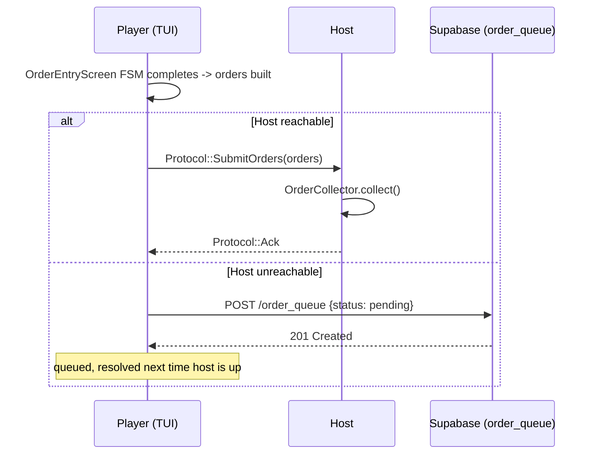

### 11d. Host comes back online — catch-up

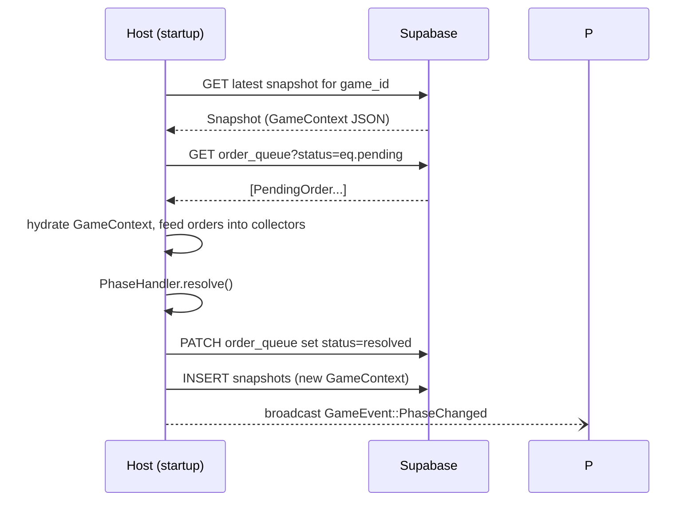

### 11e. Messaging — never touches the host

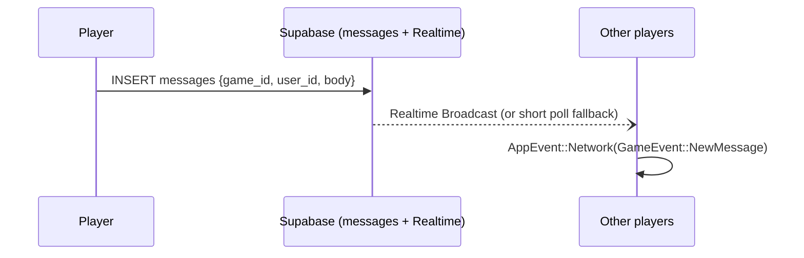

---

## 12. Supabase schema (simplified)

Keep every table's shape flat and JSON-serializable — it should mirror your Rust structs 1:1 so `serde` round-trips without a translation layer.

| Table | Key columns | Notes |
|---|---|---|
| `users` | `user_id` (uuid, PK, = `auth.users.id`) · `username` · `created_at` | Password hashing is handled by Supabase Auth itself — don't roll your own. |
| `games` | `game_id` PK · `name` · `host_user_id` FK · `host_ip` · `host_port` · `status` (open/active/paused/finished) · `discoverable` bool | `discoverable=false` gives you private/invite-only games via `game_id` sharing without extra logic. |
| `game_players` | `id` PK · `game_id` FK · `user_id` FK · `nation` · `joined_at` | |
| `snapshots` | `id` PK · `game_id` FK · `turn_number` · `phase` · `game_state` jsonb · `created_at` | `game_state` is your `Board` + `GamePhase`, serde-serialized whole. |
| `order_queue` | `id` PK · `game_id` FK · `user_id` FK · `turn_number` · `orders` jsonb (`Vec<Order>`) · `status` (pending/resolved) · `created_at` | |
| `messages` | `id` PK · `game_id` FK · `user_id` FK · `body` text · `created_at` | Add this table to the `supabase_realtime` publication so Broadcast can serve it. |

**One thing that changed on Supabase's side recently and matters here:** as of May 30, 2026, new projects default to *not* auto-exposing new tables through the Data API — you now need an explicit RLS policy/grant per table before PostgREST or Realtime can see it. <cite index="1-1">Grants control whether a role can access a table at all, while RLS controls which rows that role can see</cite>. Practically: after creating each table above, add a policy (e.g. "authenticated users can select/insert their own rows") or it'll 404 through the REST API even though it exists in Postgres.

For `messages`, prefer **Broadcast** over raw Postgres Changes if you expect more than a handful of concurrent players per game — <cite index="8-1">Postgres Changes filters and re-checks RLS per connected client, which is a known scaling cliff at higher subscriber counts, whereas Broadcast sends ephemeral messages client-to-client with lower overhead</cite>. For a Diplomacy game (max 7 players/game) this genuinely won't matter, but it costs nothing to default to Broadcast now.

---

## 13. Rust features this design actually leans on

1. **Sum types for state** — `GamePhase`, `Order`, `Screen`-adjacent `Transition` are enums with data. A `SpringMovement` phase literally cannot carry retreat data; the compiler rejects invalid states that a GoF class hierarchy in Java/C++ would only catch at runtime.
2. **Exhaustive `match`** — add a new `GamePhase` variant and every `match` on it fails to compile until you handle it. This is your regression-proofing for "adjustment phase logic" style bugs.
3. **Ownership instead of locks, where possible** — `App` on the client is the *only* thing that mutates TUI state, because the network thread only ever pushes into a channel. No `Arc<Mutex<AppState>>` needed client-side. The host *does* need `Arc<RwLock<...>>` for `GameRegistry` because it's genuinely shared across concurrent connections — use the lock only where the sharing is real.
4. **`Send + Sync` as a compiler check** — anything you put in `GameHandle` behind the `Arc<RwLock<_>>` must be `Send + Sync`; the compiler enforces this before you ever ship a data race, rather than you discovering it in production.
5. **`serde` derive** — `#[derive(Serialize, Deserialize)]` on `Protocol`, `Order`, `GameContext` gets you the wire format, the Supabase JSON columns, and the snapshot format from one annotation, instead of three hand-written parsers.
6. **`thiserror` + `?`** — typed errors per crate (`OrderError`, `AuthError`) composed with `?`, collapsed to `anyhow::Error` only at the two binary entry points.
7. **Trait objects at boundaries, generics inside** — `Command<C: Client, S: SessionKeeper>` stays generic (zero-cost, monomorphized) since it's internal; `Box<dyn Screen>` and `Box<dyn PhaseHandler>` use dynamic dispatch at the points where you need a heterogeneous collection (the screen stack, the phase-to-handler lookup) — that's the correct GoF-to-Rust translation, not "everything is `dyn`."

---

## 14. Code sketches

**Screen trait + back-stack (§7):**
```rust
pub trait Screen {
    fn render(&self, app: &App, frame: &mut Frame);
    fn handle_input(&mut self, app: &mut App, key: KeyEvent) -> Transition;
}

pub enum Transition {
    Stay,
    Push(Box<dyn Screen>),
    Pop,
    Replace(Box<dyn Screen>),
}

impl App {
    pub fn apply(&mut self, t: Transition) {
        match t {
            Transition::Stay => {}
            Transition::Push(s) => self.screen_stack.push(s),
            Transition::Pop => { self.screen_stack.pop(); }
            Transition::Replace(s) => { self.screen_stack.pop(); self.screen_stack.push(s); }
        }
    }
}
```

**GameRegistry — Registry, not Singleton (§2, §9):**
```rust
#[derive(Clone)]
pub struct GameRegistry {
    games: Arc<RwLock<HashMap<GameId, GameHandle>>>,
}

impl GameRegistry {
    pub fn new() -> Self {
        Self { games: Arc::new(RwLock::new(HashMap::new())) }
    }
    // Cloned (cheap, just bumps the Arc refcount) into every tokio::spawn'd
    // connection task in main.rs — no global static, no `unsafe`.
}
```

**PhaseHandler dispatch (State + Factory Method):**
```rust
pub trait PhaseHandler: Send + Sync {
    fn validate(&self, order: &Order, board: &Board) -> Result<(), OrderError>;
    fn resolve(&self, board: &mut Board, orders: Vec<Order>) -> Resolution;
    fn next_phase(&self, had_dislodgements: bool) -> GamePhase;
}

pub fn handler_for(phase: GamePhase) -> Box<dyn PhaseHandler> {
    match phase {
        GamePhase::SpringMovement | GamePhase::FallMovement => Box::new(MovementPhase),
        GamePhase::SpringRetreat | GamePhase::FallRetreat => Box::new(RetreatPhase),
        GamePhase::WinterBuild => Box::new(BuildPhase),
    }
}
```

**Observer via channel, not trait objects:**
```rust
// Host: GameHandle holds a broadcast::Sender<GameEvent>, cloned per subscriber.
let (tx, _) = tokio::sync::broadcast::channel::<GameEvent>(64);
tx.send(GameEvent::PlayerJoined(username))?;

// Client: network thread owns the receiving half, forwards into the TUI's mpsc channel.
while let Ok(event) = broadcast_rx.recv().await {
    app_tx.send(AppEvent::Network(event))?;
}
```

---

## 15. Suggested build order

Build bottom-up through the crates so each milestone compiles and is testable in isolation before it touches the network:

1. **`core`** — `Board`, `Order`, `GamePhase`, `PhaseHandler` + unit tests for adjudication logic. No I/O, no async.
2. **`client` skeleton** — `Screen` trait, `App`, all six screens rendering against a hardcoded fake `GameContext` (this replaces `fake_context.rs`). No network yet — validates the FSM and back-stack feel right.
3. **`host` skeleton** — `GameRegistry`, `GameHandle`, in-memory only (no Supabase). Validates order collection + phase resolution end-to-end over TCP with the real client.
4. **Wire protocol** — swap the semicolon format for `Protocol` + `serde_json`, confirm host/client still talk.
5. **Supabase: auth + discoverable games** — registration, login, game browser filtering on `discoverable=true`.
6. **Supabase: snapshots + offline queue** — `SnapshotService`, `QueuePoller`, the online/offline branch in order submission.
7. **Messaging** — `messages` table + Realtime subscription, fully decoupled from host uptime.
8. **(Optional, later)** — reintroduce the Node.js map renderer as an alternate `Screen` implementation, once everything else is stable.

Each step is independently demoable, which is the main defense against the project ballooning again.